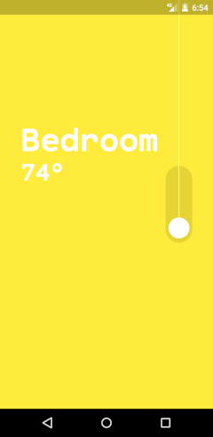
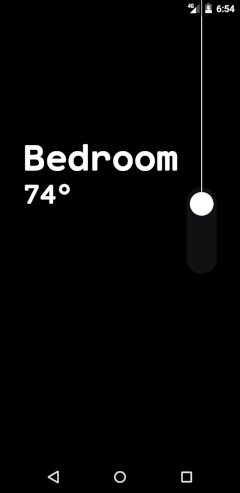

# Turn ON/OFF

Layout de um app de casa inteligente

### Instalação

 - O projeto requer o framework Flutter (https://flutter.dev/).
 - Tenha em mãos um dispositivo android em modo debug conectado à sua maquina ou um emulador instalado. 
 - Instale as dependencias e inicie o projeto
```sh
$ cd  turn_on_off
$ flutter pub get
$ flutter run
```



